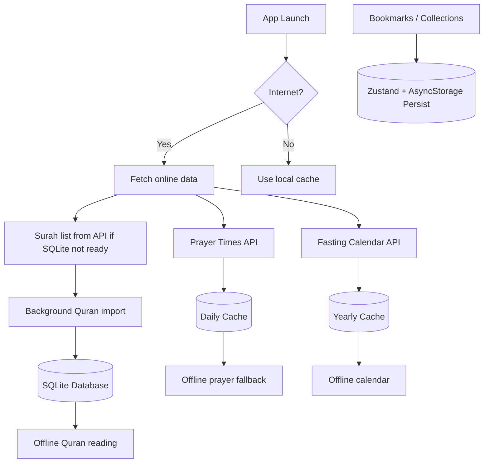

<div align="center">
  

  # NurQuran

  <p align="center">
    <strong>Quran Reader · Prayer Times · Fasting Calendar · Bookmark & Collections</strong>
    <br />
    Hybrid online/offline Islamic companion app built with Expo & React Native
  </p>

  <p>
    <a href="#features">Features</a> •
    <a href="#tech-stack">Tech Stack</a> •
    <a href="#offline-architecture">Architecture</a> •
    <a href="#getting-started">Getting Started</a> •
    <a href="#project-structure">Structure</a>
  </p>

  <p>
    
    
    
    
    <br />
    
    
    
    
    
  </p>
</div>

<br />

<p align="center">
  
</p>

---

## Features

<table>
  <tr>
    <th>Area</th>
    <th>Highlights</th>
  </tr>
  <tr>
    <td><b>📖 Quran Reader</b></td>
    <td>Surah list, verse detail with translations (Indonesian & English), share verses, bookmark, full surah audio playback with Qari selection</td>
  </tr>
  <tr>
    <td><b>📡 Offline Quran</b></td>
    <td>Background SQLite import from equran.id API; API fallback while download runs; full offline reading after import completes</td>
  </tr>
  <tr>
    <td><b>🕌 Prayer Times</b></td>
    <td>Location-based schedule via AlAdhan API, daily AsyncStorage cache, offline fallback, countdown to next prayer, 15-minute pre-notification</td>
  </tr>
  <tr>
    <td><b>📅 Fasting Calendar</b></td>
    <td>Islamic calendar with fasting events (Monday/Thursday, Ayyamul Bidh, Ashura, Ramadan), yearly cache, notification reminders</td>
  </tr>
  <tr>
    <td><b>🔖 Bookmarks</b></td>
    <td>Save individual verses, organize into custom collections with pin/unpin, search within bookmarks</td>
  </tr>
  <tr>
    <td><b>🌐 Localization</b></td>
    <td>Full English & Indonesian UI, device language auto-detection, 210 translated keys each</td>
  </tr>
  <tr>
    <td><b>🎵 Audio</b></td>
    <td>Multiple Qari options, single verse playback, full surah sequential player with mini-player controls, fallback across Qari sources</td>
  </tr>
  <tr>
    <td><b>🎨 UX</b></td>
    <td>Splash animation, loading/error states with retry, bottom tab navigation, themed dark UI, smooth scroll-to-ayah</td>
  </tr>
</table>

---

## Preview

<div align="center">
  <table>
    <tr>
      <td align="center">
        
        <br />
        <sub><b>Splash Screen</b></sub>
      </td>
      <td align="center">
        
        <br />
        <sub><b>Motion Preview</b></sub>
      </td>
      <td align="center">
        
        <br />
        <sub><b>App Icon</b></sub>
      </td>
    </tr>
  </table>
</div>

---

## Tech Stack

| Category | Tools |
|----------|-------|
| **Mobile** | Expo 54, React Native 0.81, React 19 |
| **Language** | TypeScript 5.9 |
| **State Management** | Zustand 5 (persist with AsyncStorage) |
| **Server State** | TanStack Query 5 |
| **Local Storage** | AsyncStorage, Expo SQLite |
| **Networking** | Axios, Fetch API, NetInfo |
| **Navigation** | React Navigation (Native Stack, Bottom Tabs) |
| **Location** | Expo Location |
| **Notifications** | Expo Notifications |
| **Localization** | i18next, react-i18next, Expo Localization |
| **Animation** | React Native Reanimated |
| **Icons** | lucide-react-native |
| **Audio** | Expo AV |

---

## Offline Architecture



**How it works:** Quran data downloads into SQLite in the background. While downloading, verses load from the API so there's no wait. Once SQLite is complete, everything works offline. Prayer times cache daily; fasting calendar caches yearly. Bookmarks and collections are persisted locally through Zustand.

---

## Project Structure

```
src/
├── api/                # Quran, translation & prayer API clients (equran.id, AlAdhan, AlQuran Cloud)
├── animations/         # Splash & Reanimated animation helpers
├── components/         # Shared UI components organized by domain
│   ├── bookmark/       # BookmarkItem, BookmarkSectionHeader, AddCollectionCard
│   ├── collection/     # CollectionInfo, AyatItemCollection
│   ├── fasting/        # CalendarHeader, CalendarDay, CalendarLegend
│   ├── home/           # GreetingSection, LastReadCard, HomeTabBar, EmptyState
│   ├── prayer/         # TodayPrayerCard, PrayerRow
│   ├── search/         # SearchHeader, SearchResultsList, RecentSearches
│   ├── surah/          # SurahHeader, AyatItemSurah, FullSurahMiniPlayer
│   └── bottom-tab/     # TabIcon, MainTabNavigator
├── constants/          # Colors, qari configuration, screen dimensions
├── contexts/           # ThemeContext (light/dark mode)
├── hooks/              # 22 custom hooks: audio, prayer, fasting, bookmarks, search, notifications
├── locales/            # en.json (210 keys), id.json (210 keys)
├── navigation/         # React Navigation stack & tab configuration
├── screen/             # 9 screens: Home, Prayer, Fasting, Bookmarks, Search, Splash + detail screens
├── services/           # QuranDatabase (SQLite), prayer cache, fasting calendar cache
├── store/              # Zustand store: onboarding, offline mode, bookmarks, collections, prayer
├── types/              # TypeScript interfaces: Quran, Ayah, Bookmark, Collection, Prayer
└── utils/              # Helpers: audio, bookmarks, calendar, fasting, notification, prayer, search
```

---

## Getting Started

### Prerequisites

- **Node.js** ≥ 18
- **npm**
- **Expo CLI** (`npx expo`)
- **Android Studio** or **Xcode** (for emulator/simulator)

### Install

```bash
git clone https://github.com/xyconix11x/nurquran.git
cd nurquran
npm install
```

### Run

```bash
npm run start        # Start Expo dev server
npm run android      # Launch on Android emulator/device
npm run ios          # Launch on iOS simulator
npm run web          # Web preview
```

### Type Check

```bash
npx tsc --noEmit
```

---

## Data Sources & Strategy

| Data | API Source | Local Strategy |
|------|-----------|----------------|
| Quran surahs & verses | [equran.id](https://equran.id/api/v2/surat) | Full SQLite import (background) |
| English translation | [AlQuran Cloud](https://api.alquran.cloud/v1) | API fallback per surah |
| Prayer times | [AlAdhan](https://api.aladhan.com/v1/timings) | Daily AsyncStorage cache |
| Fasting calendar | [AlAdhan calendar](https://api.aladhan.com/v1/hijriCalendar) | Yearly AsyncStorage cache |
| Quran audio | [equran.id CDN](https://cdn.equran.id), [Islamic Network](https://cdn.islamic.network) | Streaming (no local cache) |
| Bookmarks & collections | User input | Zustand persist → AsyncStorage |

**Quran data flow:**
1. App starts → try loading from SQLite
2. If SQLite empty → fetch surah list from API for immediate display
3. Background import writes all surahs + verses into SQLite
4. On subsequent launches, read entirely from SQLite (offline-capable)
5. English translations fetched per-surah when requested (not pre-imported)

---

## Localization

| Language | File | Status |
|----------|------|--------|
| English | `src/locales/en.json` | 210 keys, base language |
| Indonesian | `src/locales/id.json` | 210 keys, full translation |

Language auto-detected from device locale. Indonesian uses Indonesian UI and Quran tafsir text. All other locales fall back to English.

---

## Play Store Build

```bash
# Production Android build
eas build --platform android --profile production

# Production iOS build
eas build --platform ios --profile production

# Submit to stores
eas submit --platform android --profile production
eas submit --platform ios --profile production
```

Configure store credentials, screenshots, and privacy policy in the respective console before submitting.

---

## Core Files

| File | Purpose |
|------|---------|
| `src/services/quranDatabase.ts` | SQLite schema, background Quran import, offline queries |
| `src/components/preloadQuranData.ts` | Boot sequence: try SQLite → fallback API → background import |
| `src/hooks/useSurahDetail.ts` | Surah detail: SQLite first, API while download incomplete |
| `src/hooks/useAudioPlayer.ts` | Single ayah playback with Qari fallback |
| `src/hooks/useFullSurahPlayer.ts` | Sequential full surah audio with mini-player |
| `src/hooks/usePrayerTimes.ts` | Prayer time fetching, caching, timeout handling |
| `src/services/prayerCache.ts` | Daily prayer time AsyncStorage cache |
| `src/services/fastingCalendarCache.ts` | Yearly fasting calendar AsyncStorage cache |
| `src/store/useAppStore.ts` | Zustand store: bookmarks, collections, offline state, prayer, reminders |
| `src/utils/notificationHelpers.ts` | Schedule & manage fasting/event notifications |
| `App.tsx` | Root: ThemeProvider → I18nextProvider → QueryClient → ErrorBoundary → Navigator |

---

## License

MIT — use it, modify it, ship it.

<div align="center">
  <br />
  <sub>Built with ❤️ by <a href="https://github.com/xyconix11x">s3r3</a></sub>
  <br />
  
</div>
