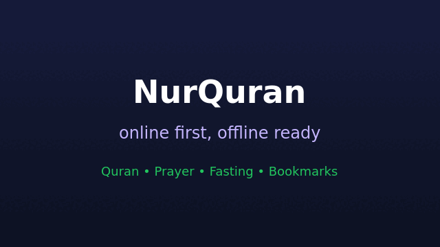
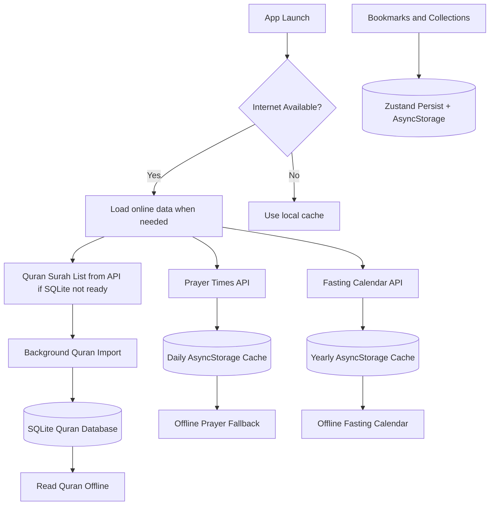

<div align="center">
  

  <h1>NurQuran</h1>

  <p>
    A modern Islamic companion app for reading Quran, tracking prayer times,
    managing fasting reminders, and saving ayahs for daily reflection.
  </p>

  <p>
    
  </p>

  <p>
    
    
    
    
  </p>

  <p>
    
    
    
    
    
  </p>
</div>

---

## Preview

<div align="center">
  
</div>

<br />

<div align="center">
  <table>
    <tr>
      <td align="center" width="33%">
        
        <br />
        <b>Splash</b>
      </td>
      <td align="center" width="33%">
        
        <br />
        <b>Brand</b>
      </td>
      <td align="center" width="33%">
        
        <br />
        <b>Motion</b>
      </td>
    </tr>
  </table>
</div>

---

## What Makes It Different

NurQuran is built as a **hybrid online/offline** app:

- When the user has internet, the app stays online and can refresh dynamic data.
- Quran data is downloaded into SQLite in the background.
- While the offline Quran download is still running, users can read from the API immediately.
- After the Quran database is complete, Quran reading works offline from SQLite.
- Prayer times are cached per day so the app does not hit the API again and again.
- Fasting calendar data is cached per year for offline access.
- Bookmarks and collections are stored locally.

---

## Features

| Area | Highlights |
|---|---|
| Quran Reader | Surah list, surah detail, ayah translation, share, bookmark, full surah playback |
| Offline Quran | SQLite import from API, background download, API fallback before download completes |
| Prayer Times | Location-based prayer schedule, daily cache, offline fallback |
| Fasting Calendar | Islamic calendar, fasting events, yearly cache, notification reminders |
| Bookmarks | Saved ayahs, custom collections, pinned collection support |
| Localization | English and Indonesian UI, flexible language handling |
| Audio | Qari selection, single ayah playback, full surah playback controls |
| UX | Splash animation, loading/error states, bottom navigation, themed screens |

---

## Tech Stack

<div align="center">

| Layer | Tools |
|---|---|
| Mobile | Expo, React Native, React 19 |
| Language | TypeScript |
| State | Zustand |
| Server State | TanStack Query |
| Local Storage | AsyncStorage, Expo SQLite |
| Network | Axios, Fetch API, NetInfo |
| Location | Expo Location |
| Notifications | Expo Notifications |
| Localization | i18next, react-i18next, Expo Localization |
| Motion | React Native Reanimated |
| Icons | lucide-react-native |

</div>

---

## Offline Architecture



---

## Project Structure

```txt
nurquran/
├─ assets/                     # App icons, splash images, SVG assets
├─ src/
│  ├─ api/                     # Quran and Juz API clients
│  ├─ animations/              # Splash and UI animation helpers
│  ├─ components/              # Shared and screen-specific components
│  │  ├─ bookmark/
│  │  ├─ collection/
│  │  ├─ fasting/
│  │  ├─ home/
│  │  ├─ prayer/
│  │  ├─ search/
│  │  └─ surah/
│  ├─ constants/               # Colors, screen configs, qari data
│  ├─ contexts/                # Theme provider
│  ├─ hooks/                   # Feature hooks and business logic
│  ├─ locales/                 # English and Indonesian translations
│  ├─ navigation/              # Native stack navigation
│  ├─ screen/                  # Main app screens
│  ├─ services/                # SQLite, cache, offline services
│  ├─ store/                   # Zustand app store
│  ├─ types/                   # TypeScript types
│  └─ utils/                   # Helpers for Quran, audio, search, calendar
├─ App.tsx
├─ app.json
├─ package.json
└─ README.md
```

---

## Getting Started

### Prerequisites

- Node.js 18 or newer
- npm
- Expo development environment
- Android Studio or Xcode if running on an emulator/simulator

### Install

```bash
npm install
```

### Run

```bash
npm run start
```

Run directly on a target:

```bash
npm run android
npm run ios
npm run web
```

---

## Useful Scripts

| Command | Description |
|---|---|
| `npm run start` | Start Expo dev server |
| `npm run android` | Open on Android |
| `npm run ios` | Open on iOS |
| `npm run web` | Open web preview |
| `npx tsc --noEmit --pretty false` | Type-check the project |

---

## Data Strategy

| Data | Source | Local Strategy |
|---|---|---|
| Quran metadata | equran.id | SQLite |
| Quran ayahs | equran.id | SQLite after background import |
| English translation | AlQuran Cloud | API fallback/cache through query flow |
| Prayer times | AlAdhan | Daily AsyncStorage cache |
| Fasting calendar | AlAdhan calendar endpoint | Yearly AsyncStorage cache |
| Bookmarks | User input | Zustand persist |
| Collections | User input | Zustand persist |

---

## Localization

NurQuran supports:

- English
- Indonesian

Language is detected from the device. Indonesian uses Indonesian UI and Quran meaning text. Other languages fall back to English behavior.

Translation files:

```txt
src/locales/en.json
src/locales/id.json
```

---

## Core Files

| File | Purpose |
|---|---|
| `src/components/preloadQuranData.ts` | Loads online surah list first, then imports Quran offline in the background |
| `src/services/quranDatabase.ts` | SQLite schema, Quran import, and offline Quran queries |
| `src/hooks/useSurahDetail.ts` | Reads surah detail from SQLite, falls back to API while download is incomplete |
| `src/services/prayerCache.ts` | Daily prayer time cache |
| `src/services/fastingCalendarCache.ts` | Yearly fasting calendar cache |
| `src/store/useAppStore.ts` | Global app state, bookmarks, Quran download state, prayer state |
| `src/utils/surahMeaning.ts` | English/Indonesian surah meaning display helper |

---

## Roadmap

- [ ] Add real app demo GIF to `docs/demo.gif`
- [ ] Add screenshots for home, surah detail, prayer, fasting, bookmarks
- [ ] Add Quran offline download progress indicator in settings
- [ ] Add manual sync button for Quran data
- [ ] Add offline audio download option
- [ ] Add more translations
- [ ] Add automated tests for cache and offline behavior

---

## Contributing

Pull requests are welcome. Keep changes focused, typed, and consistent with the existing React Native patterns.

Recommended check before submitting:

```bash
npx tsc --noEmit --pretty false
```

---

## License

MIT License. Use it, customize it, and make it better.

<div align="center">
  <br />
  
</div>
